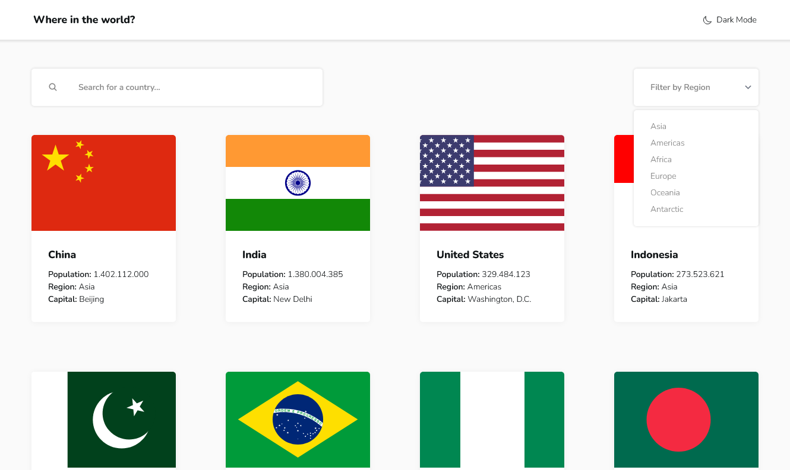

# Frontend Mentor - REST Countries API with color theme switcher solution

This is a solution to the [REST Countries API with color theme switcher
challenge on Frontend
Mentor](https://www.frontendmentor.io/challenges/rest-countries-api-with-color-theme-switcher-5cacc469fec04111f7b848ca).
Frontend Mentor challenges help you improve your coding skills by building
realistic projects.

## Table of contents

- [Overview](#overview)
  - [The challenge](#the-challenge)
  - [Screenshot](#screenshot)
  - [Links](#links)
- [My process](#my-process)
  - [Built with](#built-with)
  - [What I learned](#what-i-learned)
- [Author](#author)

## Overview

### The challenge

Users should be able to:

- See all countries from the API on the homepage
- Search for a country using an `input` field
- Filter countries by region
- Click on a country to see more detailed information on a separate page
- Click through to the border countries on the detail page
- Toggle the color scheme between light and dark mode _(optional)_

### Screenshot



### Links

- Solution URL:
  [https://github.com/mamidenn/rest-countries-api-with-color-theme-switcher](https://github.com/mamidenn/rest-countries-api-with-color-theme-switcher)
- Live Site URL:
  [https://rest-countries.martin-dennhardt.de/](https://rest-countries.martin-dennhardt.de/)

## My process

### Built with

- Semantic HTML5 markup
- Flexbox
- CSS Grid
- [SvelteKit](https://kit.svelte.dev/) - Frontend framework
- [Tailwind CSS](https://tailwindcss.com/) - CSS framework

### What I learned

I didn't know that Svelte supported Generic Components. I used them to create
the Dropdown Component. It looks like this:

```ts
type T = $$Generic;
export let selected: T | null = null;
export let options: T[] = [];
```

Very handy since you get type-safety when binding the `selected` property.

I also rediscovered the [Description List
(`<dl>`)](https://developer.mozilla.org/en-US/docs/Web/HTML/Element/dl) element.
I used it to display the country details as they are key-value pairs.

## Author

- Website - [Martin Dennhardt](https://github.com/mamidenn)
- Frontend Mentor - [@mamidenn](https://www.frontendmentor.io/profile/mamidenn)
